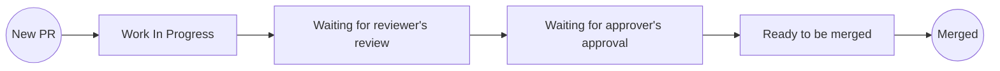
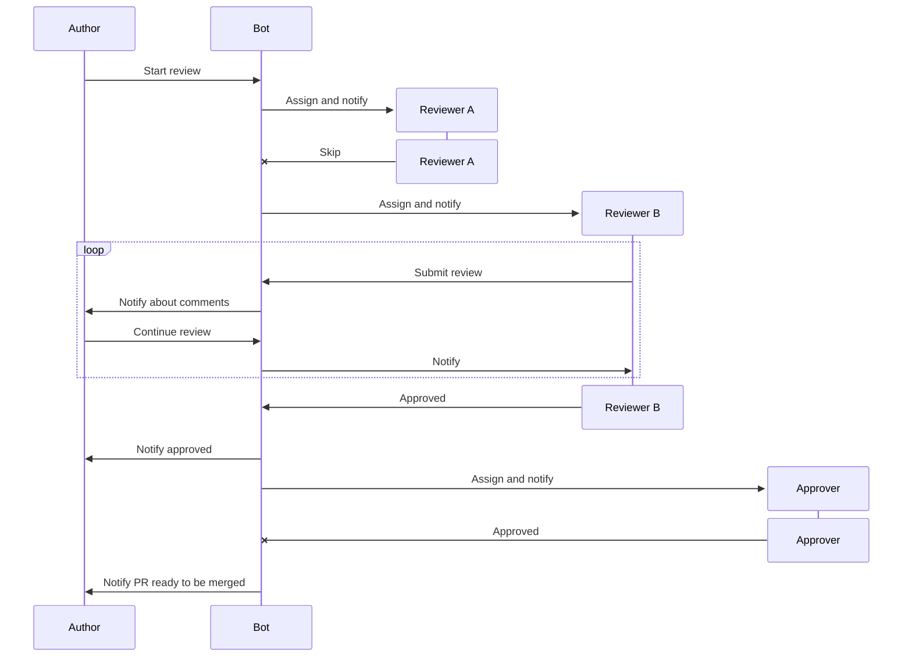

# Code Review Bot
Bot for Max messenger that maintains and facilitates code review process.

## Environment variables
`TAMTAM_BOTAPI_ENDPOINT` - defines messenger's bot API endpoint
`BOT_API_TOKEN` - defines token to access messenger's bot API 

## Bot commands
- `/start_review {url}` - submit PR for review
- `/submit_review {url|id}` - submit review comments
- `/approve {url|id}` - approve PR
- `/pass {url|id}` - reassign PR to another person (can be used by reviewers)
- `/show_my_reviews` - show PRs waiting for your review
- `/show_my_requests` - show PRs you submitted for review (only open)
- `/cancel_pr {url|id}` - cancel PR submitted for review

## Workflows

The following section describes workflows that bot follows and maintains.

### Mermaid

This project uses [Mermaid](https://mermaid.js.org/) - JavaScript based diagramming and charting tool that renders Markdown-inspired text
definitions to create and modify diagrams dynamically. GitHub renders this
diagrams [automatically](https://github.blog/developer-skills/github/include-diagrams-markdown-files-mermaid/). To render diagrams in
Intellij IDEA you can
use [Mermaid plugin](https://plugins.jetbrains.com/plugin/index?xmlId=com.intellij.mermaid&utm_source=product&utm_medium=link&utm_campaign=IU&utm_content=2024.1)
developed and maintained by JetBrains.

### Pull request (PR) life cycle

### Code review workflow

Process participants:

**Author** - person who wrote code and submitted PR \
**Reviewer A** - person who was assigned to be a first-line reviewer but rejected the assignment due to personal reasons (e.g. being too
busy) \
**Reviewer B** - person who was assigned to be a first-line reviewer and performed review \
**Approver** - person who was assigned to be a second-line reviewer and performed review

